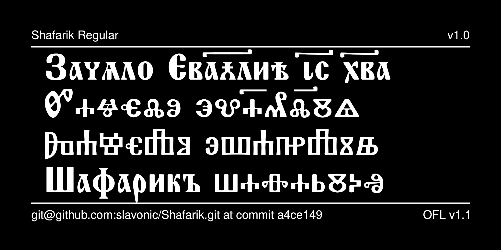

# Shafarik Typeface

The Shafarik font, named after
[Pavel Jozef Šafárik](https://en.wikipedia.org/wiki/Pavel_Jozef_%C5%A0af%C3%A1rik)
(1795–1861), Slovak-born scholar and one of the founders of modern
Slavic philology, is a specialized font intended for an academic
presentation of Old Church Slavonic (OCS) texts written in either
the Cyrillic or Glagolitic alphabets.



## History

The font is based on CyrillicaShafarik by SynthesisSoft, 1994,
subsequently redesigned by Nikita Simmons and edited by
Aleksandr Andreev and Nikita Simmons as part of the
[Slavonic Computing Initiative](https://sci.ponomar.net/fonts.html).

## License

This Font Software is licensed under the SIL Open Font License,
Version 1.1. This license is available with a FAQ at
[https://openfontlicense.org/](https://openfontlicense.org/).

## Building the Fonts

The font source is stored in a FontForge SFD file in the `sources/` directory. All modifications should be made in FontForge, resulting in an updated SFD file. This file is then converted to UFO format by running the convert script. From terminal:

```
cd your/local/project/directory
./convert.sh
```

The font can then be built using fontmake and gftools by running:

```
make build
```

Note that this requires Python and will install all of the necessary libraries and tools into a virtualenv at `venv/`.

To delete the virtualenv and the results of the build, run:

```
make clean
```

To build the sample image the sits at the top of this README, run:

```
make images
```

The commands `make update` and `make update-project-template` update the repository structure and Python dependencies and should be run periodically.

Google's master repository also had a GitHub workflow for building the fonts in the cloud on push, but this seems to always fail because of incorrect dependencies, so has been disabled. Instead, built binaries are stored on GitHub in the `fonts/` directory.

This font has been added to [Google Fonts](https://fonts.google.com/specimen/Shafarik) and is available for use in Google Docs and other cloud-based software.

## Features

See the [documentation file](documentation/documentation.pdf)
for a description of the features. Presently the documentation
is available as a PDF document, eventually this document will be
converted to a webpage.

## More Church Slavonic Fonts

See the [main repository](https://github.com/typiconman/fonts-cu/issues) and the [website](https://sci.ponomar.net/fonts.html).