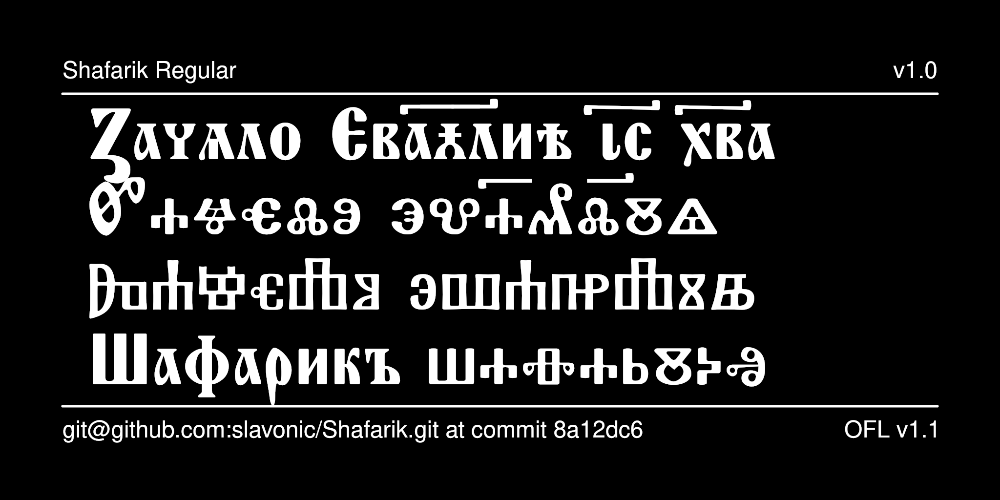

# Shafarik Typeface

The Shafarik font, named after
[Pavel Jozef Šafárik](https://en.wikipedia.org/wiki/Pavel_Jozef_%C5%A0af%C3%A1rik)
(1795–1861), Slovak-born scholar and one of the founders of modern
Slavic philology, is a specialized font intended for an academic
presentation of Old Church Slavonic (OCS) texts written in either
the Cyrillic or Glagolitic alphabets.



## History

The initial design of this font was based on several freeware fonts
available on the Internet, but all original designs have
undergone significant development by Aleksandr Andreev and
Nikita Simmons as part of the
[Slavonic Computing Initiative](https://sci.ponomar.net/fonts.html).

## License

This Font Software is licensed under the SIL Open Font License,
Version 1.1. This license is available with a FAQ at
[https://openfontlicense.org/](https://openfontlicense.org/).

## Building the Fonts

The font is built using fontmake and gftools post processing script. Tools are all python based, so it must be previously installed.

To install all the Python tools into a virtualenv, do the following:

From terminal:

```

cd your/local/project/directory

#once in the project folder create a virtual environment. 
This step has to be done just once, the first time:

python3 -m venv venv

#activate the virtual environment

source venv/bin/activate

#install the required dependencies

pip install -r requirements.txt

```

Then run the this command:

```
cd sources
gftools builder config.yaml
```

The fonts are supposed to build automatically in the repository 
using GitHub Actions, but this does not work correctly 
for some reason.

## Features

See the [documentation file](documentation/documentation.pdf)
for a description of the features. Presently the documentation
is available as a PDF document, eventually this document will be
converted to a webpage.

## More Church Slavonic Fonts

See the [main repository](https://github.com/typiconman/fonts-cu/issues) and the [website](https://sci.ponomar.net/fonts.html).